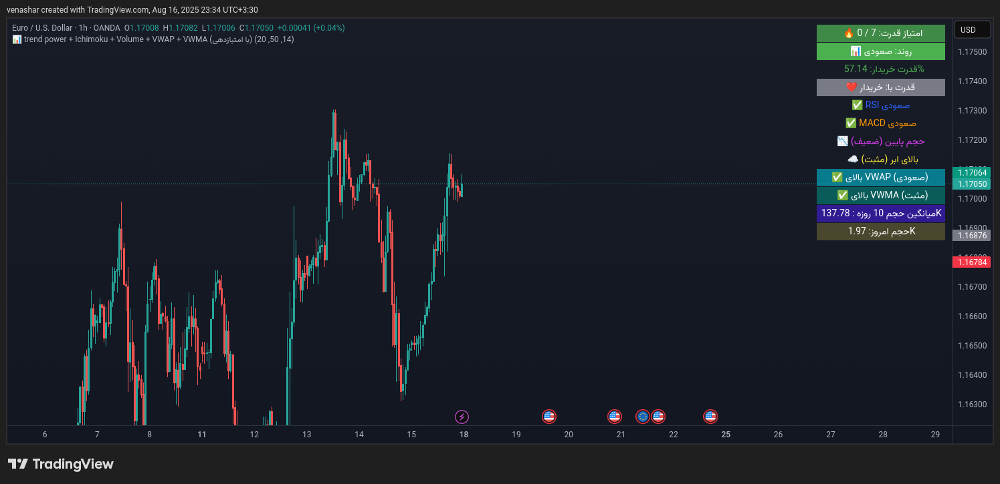

# 📊 Indicator: Trend Power + Ichimoku + Volume + VWAP + VWMA (with Scoring)

# 📊 اندیکاتور Trend Power + Ichimoku + Volume + VWAP + VWMA (با امتیازدهی)

This indicator is built for **TradingView (Pine Script v5)** and acts as a **composite technical analysis tool** that combines multiple confirmations into one clear view. It calculates market power, evaluates signals from popular indicators, and displays everything in a summary table.  

## ✨ Features
- Measures **buyer vs. seller strength** based on candlestick patterns  
- Detects market trend using **SMA**  
- Confirms signals with **RSI and MACD**  
- Analyzes trading volume against its moving average  
- Uses **Ichimoku Cloud** to evaluate price relative to the cloud  
- Computes and shows position relative to **VWAP**  
- **⭐️ New: VWMA (Volume Weighted Moving Average)** added for more precision  
- **Smart scoring system (Bull/Bear Score)** combining multiple indicators  
- Displays all results in a structured table on the chart (latest candle only)  

---

## 📷 Preview

---

## 🛠️ Installation
1. Go to [TradingView](https://www.tradingview.com/).  
2. Open the **Pine Editor** from the bottom panel.  
3. Copy and paste the code from [`indicator.pine`](./indicator.pine).  
4. Click **Add to chart**.  

---

## ⚙️ Indicator Inputs
- `length` → Lookback period for candle strength (default: 14)  
- `smaLength` → Period for trend SMA (default: 50)  
- `vwmaLength` → VWMA length (default: 20)  

---

## 📑 Scoring System
The indicator calculates a **bullish vs. bearish score** based on:  
1. SMA trend  
2. Candle power (buyers vs. sellers)  
3. RSI (thresholds at 45 and 55)  
4. MACD  
5. Ichimoku Cloud  
6. VWAP  
7. **VWMA (new)**  

---

## 📜 License
This project is released under the **GNU General Public License v3.0 (GPL-3.0)**.  
You are free to modify and redistribute the code, but derivative works must also be licensed under GPL-3.  

---

## 🤝 Contribution
- Submit a Pull Request  
- Open an Issue with suggestions or bug reports  

---

## 👨‍💻 Author
Developed by **[daedalusfx]**.  

این اندیکاتور برای **TradingView (Pine Script v5)** توسعه داده شده و یک ابزار **تحلیل تکنیکال ترکیبی** است که قدرت روند، سیگنال‌های اندیکاتوری و حجم معاملات را در یک نگاه به صورت جدول نمایش می‌دهد.  

## ✨ ویژگی‌ها
- محاسبه **قدرت خریداران و فروشندگان** بر اساس کندل‌ها  
- تشخیص روند با استفاده از **SMA**  
- تأیید روند با **RSI و MACD**  
- بررسی حجم معاملات و مقایسه با میانگین متحرک حجم  
- استفاده از **Ichimoku Cloud** برای تحلیل وضعیت قیمت نسبت به ابر کومو  
- محاسبه و نمایش موقعیت نسبت به **VWAP**  
- **⭐️ اضافه شده: VWMA** (Volume Weighted Moving Average) برای دقت بیشتر در تحلیل  
- سیستم **امتیازدهی هوشمند (Bull/Bear Score)** بر اساس چندین معیار همزمان  
- نمایش اطلاعات در قالب جدول در گوشه چارت (قابل مشاهده در آخرین کندل)  

---

---

## 🛠️ نصب
1. وارد وبسایت [TradingView](https://www.tradingview.com/) شوید.  
2. از منوی بالا روی **Pine Editor** کلیک کنید.  
3. کد موجود در فایل [`indicator.pine`](./indicator.pine) را کپی و جایگذاری کنید.  
4. روی **Add to chart** کلیک کنید.  

---

## ⚙️ ورودی‌های اندیکاتور
- `length` → بازه بررسی قدرت کندل‌ها (پیش‌فرض: 14)  
- `smaLength` → طول میانگین متحرک ساده برای روند (پیش‌فرض: 50)  
- `vwmaLength` → طول VWMA (پیش‌فرض: 20)  

---

## 📑 سیستم امتیازدهی
اندیکاتور بر اساس معیارهای زیر به روند امتیاز مثبت/منفی می‌دهد:  
1. روند SMA  
2. قدرت کندل‌ها  
3. RSI (با آستانه 45 و 55)  
4. MACD  
5. Ichimoku Cloud  
6. VWAP  
7. **VWMA (جدید)**  

---

## 📜 لایسنس
این پروژه تحت لایسنس **GNU General Public License v3.0 (GPL-3.0)** منتشر شده است.  
شما می‌توانید کد را تغییر داده و بازتوزیع کنید، اما باید نسخه‌های اصلاح‌شده نیز تحت همین لایسنس منتشر شوند.  

---

## 🤝 مشارکت
- Pull Request بفرستید.  
- Issue باز کنید و پیشنهاد یا گزارش باگ بدهید.  

---

## 👨‍💻 نویسنده
daedalusfx
